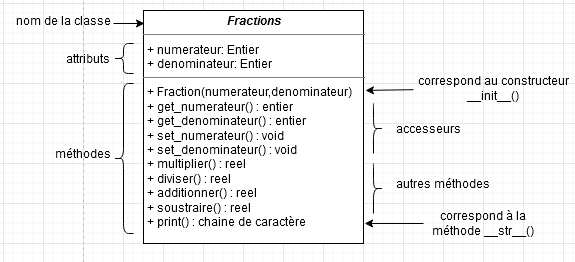

# Un peu d'histoire

La programmation orientée objet est un nouveau paradigme de programmation.

Les idées sous-tendant le paradigme objet datent des années 60. Mais il faudra attendre le début des années 70 et la mise au point du langage Smalltalk pour que le paradigme objet gagne en popularité chez les informaticiens. 

Ajourdh'hui de nombreux langages permettent d'utiliser le paradigme objet : C++, Java, Python...

# Un petit exemple d'approche : où vous utilisez déjà des Objets

Prenons une chaîne de caractère quelconque : *chaine*. Completez la ligne ci-dessous pour transformer cette chaîne avec uniquement des minuscules :

{{ IDEv('scripts/test') }}


Vous venez tout juste d'utiliser *chaine* comme un **objet** en utilisant la **méthode** *lower()*.

# La POO

## Vocabulaire

La programmation orientée objet repose, comme son nom l'indique, sur le concept d'objet.

Un objet dans la vie de tous les jours, vous connaissez, mais en informatique, qu'est ce que c'est ? Une variable ? Une fonction ? Ni l'un ni l'autre, c'est un nouveau concept.

Imaginez un objet (de la vie de tous les jours) très complexe (par exemple un moteur de voiture) : il est évident qu'en regardant cet objet, on est frappé par sa complexité (pour un non spécialiste). Imaginez que l'on enferme cet objet dans une caisse et que l'utilisateur de l'objet n'ait pas besoin d'en connaître son principe de fonctionnement interne pour pouvoir l'utiliser. L'utilisateur a, à sa disposition, des boutons, des manettes et des écrans de contrôle pour faire fonctionner l'objet, ce qui rend son utilisation relativement simple. La mise au point de l'objet (par des ingénieurs) a été très complexe, en revanche son utilisation est relativement simple. Programmer de manière orientée objet, c'est un peu reprendre cette idée : utiliser des objets sans se soucier de leur complexité interne. Pour utiliser ces objets, nous n'avons pas à notre disposition des boutons, des manettes ou encore des écrans de contrôle, mais des **attributs** et des **méthodes** (nous aurons l'occasion de revenir longuement sur ces 2 concepts). Un des nombreux avantages de la programmation orientée objet (**POO**), est qu'il existe des milliers d'objets (on parle plutôt de classes, mais là aussi nous reviendrons sur ce terme de classe un peu plus loin) prêts à être utilisés (vous en avez déjà utilisé de nombreuses fois sans le savoir). On peut réaliser des programmes extrêmement complexes uniquement en utilisant des classes préexistantes.

Dans la suite de ce cours, nous utiliserons l'exemple des fractions en mathématiques.

Considérons donc la classe des fractions.

La classe est une espèce de "moule", à partir duquel nous allons créer des **objets** (plus exactement nous parlerons d'**instances**). Par exemple, pour la classe Fractions, nous pouvons créer différentes instances de cette classe (frac1,frac2...). Pour créer une de ces instances, la procédure est relativement simple : 
frac1=Fractions(), frac2=Fractions(),...

Mais pour le moment, notre classe ne sert à rien car il n'y a rien dedans.

Comme expliqué précédemment, une instance de classe possède des attributs et des méthodes. Commençons par les attributs :

Un **attribut** possède une valeur (un peu comme une variable). Nous allons associer un attribut *numerateur* et un attribut *denominateur* à notre classe Fractions.

Ces attributs s'utilisent comme des variables.

L'utilisateur va vouloir accéder aux différents attributs de son instance et modifier éventuellement ces attributs. Pour cela, on créera deux méthodes : *get()* (pour accéder) et *set()* (pour modifier).

Il ne faut pas oublier que notre classe doit être "enfermée dans une caisse" pour que l'utilisateur puisse l'utiliser facilement sans se préoccuper de ce qui se passe à l'intérieur. Il faut donc, à la création d'une instance, que tous ses attributs soient définis à l'aide d'une **méthode**, ici le **constructeur** *\_\_init\_\_* : la méthode *\_\_init\_\_()* est automatiquement exécutée au moment de la création d'une instance.

Il faudra aussi que l'utilisateur puisse faire des opérations sur les instances créées. Par exemple, il voudra multiplier des fractions, les additionner... toutes ces opérations vont être définies dans la classe par des **méthodes** : ce sont des fonctions à l'intérieur de la classe.

On aura donc les méthodes *multiplier()*, *diviser()*, *additionner()* et *soustraire()*.

L'utilisera voudra enfin afficher les résultats de ses opérations, il faudra donc créer une méthode pour cela : *\_\_str\_\_()* qui sera appelé lors d'un *print(...)*.

**En résumé** :

Une classe est caractérisée par :

- un nom (ici *Fractions*)
- des **attributs** (on parle aussi de **champs** ou **variables d'instances**) (ici *numerateur* et *denominateur*)
- des **méthodes** : ce sont des fonctions de traitement de données de la classe. Parmis celles-ci, on retrouve :
  - le **constructeur** : elle initialise les données de la classe à leur création
  - les **accesseurs** :
    - en **lecture** : elle se contente de renvoyer la valeur d'une variable d'instance. (ici *get()*)
    - en **écriture** : elle se contente de modifier la valeur d'une variable d'instance, avec éventuellement une vérification de la nouvelle valeur. (ici *set()*)
  - les autres : ce sont des fonctions de traitement de données de la classe. (ici *multiplier()*,...)


## Modèle UML

Nous pouvons résumer l'ensemble de ce qui a été dit dans un schéma appelé diagramme de classe (modèle UML).

Pour notre classe Fractions, cela donnera :



## Mise en pratique avec Python

Ouvrez le [notebook](Documents/fractions.ipynb) : fractions.ipynb et faites le TP.

# Exercices

**Exercice 1**

On considère le code suivant :

```python
class  Personne:
  def  __init__(self,  nom,  age):
      self.set_nom(nom)
      self.set_age(age)
    
  def set_nom(self,nouveau_nom):
    self.nom=nouveau_nom
    
  def set_age(self,nouvel_age):
    self.age=nouvel_age
        
  def get_nom(self):
    return self.nom
    
  def get_age(self):
    return self.age
    
  def  Vieillir(self,  periode):
    self.set_age(self.get_age() + periode)
    return  f"le  nouvel  age  de  {self.get_nom()}  est : {str(self.get_age())}"
    
Moi  =  Personne("Albert",  51)
Monchien  =  Personne("Rex",  14)

for  i  in  range(3):
  Moi.Vieillir(1)
  Monchien.Vieillir(7)
```
1) Quels sont les noms des attributs d’un objet de la classe Personne ?
2) Que fait la méthode Vieillir ?
3) A la fin de la boucle, on execute à la console :

```python
Moi.age
```
Quel est l'affichage?

4) Quel est l'âge de Rex après l'exécution du programme, comment l'obtenir?

**Exercice 2**

A l’aide du code Python ci-dessous, répondre aux questions suivantes :

1) Quels sont les noms des attributs de R1 et R2 ?
2) Compléter la méthode afficher_aire() permettant de calculer l’aire d’un rectangle.
3) Compléter les lignes de commandes à la console pour afficher les aires et périmètres de R1 et R2.

```python
class  Rectangle:
  def  __init__(self,  longueur,  largeur):
      self.set_longueur(longueur)
      self.set_largeur(largeur)
    
  def get_largeur(self):
    return self.largeur
    
  def get_longueur(self):
    return self.longueur

  def set_longueur(self,nouvel_longueur):
    self.longueur=nouvel_longueur
    
  def set_largeur(self,nouvel_largeur):
    self.largeur=nouvel_largeur
    
  def  afficher_perimetre(self):
    p  =  2*(self.get_largeur()+self.get_longueur())
    return  f"le  perimetre  du  rectangle  est  :  {str(p)}"
  
  
  def  afficher_aire(self):
  
  
R1  =  Rectangle(4,3)
R2  =  Rectangle(5,6)
```


```python
>>>
>>>
>>>
```

**Exercice 3**

Les loueurs de voitures doivent gérer l’entretien des voitures de location. En principe il faut effectuer une révision
tous les 20 000 km. (Quand on a dépassé les 20 000 km puis les 40 000 km, ...)

On suppose écrite la classe « vehicule », dont on vous donne les en-têtes de méthodes :

```python
class  Vehicule:
  def  __init__(self,  marque,  modele,  km,  nbRevisions):
    self.set_marque(marque)
    self.set_modele(modele)
    self.set_km(km)
    self.set_nbRevisions(nbRevisions)
    
  def get_marque(self):
    return self.marque
    
  def get_modele(self):
    return self.modele
    
  def get_km(self):
    return self.km
    
  def get_nbRevisions(self):
    return self.nbRevisions

  def set_marque(self,nouvel_marque):
    self.marque=nouvel_marque
    
  def set_modele(self,nouveau_modele):
    self.modele=nouveau_modele
        
  def set_km(self,nouveau_km):
    self.km=nouveau_km
        
  def set_nbRevisions(self,nouvel_nbRevisions):
    self.nbRevisions=nouvel_nbRevisions
    
    
  def  bilan(self):
  
  
  
  def  faire_revision(self):
  
  
  
  def  ajouter_km(self,  km_parcourus):
  
  
  

```

1) Créer les trois véhicules suivants :

- Voiture1 : une Peugeot 107 toute neuve
- Voiture2 : une Peugeot 207 de 15 000 km
- Voiture3 : une Peugeot 307 de 26 000 km ayant déjà effectué une révision
2) Compléter la méthode « bilan » permettant d’afficher la marque, le modèle de la voiture, le nombre de km, ainsi que le nombre de révisions déjà effectuées.
3) Compléter la méthode « faire_revision » de manière à incrémenter l’attribut correspondant au nombre de révisions.
4) A chaque retour d’une voiture le loueur ajoute à la voiture le nombre de kilomètres effectués.\
Compléter la méthode « ajouter_km » permettant d’ajouter à la voiture le nombre de kilomètres parcourus.\
En fonction du nombre de kilomètres total de la voiture, la méthode « ajouter_km » devra appeler la méthode « faire_revision ».\
Exemple 1 : La voiture a 15 000 km, elle a parcouru 4 000 km soit un total de 19 000 km. La méthode doit uniquement ajouter les kilomètres.\
Exemple 2 : La voiture a 15 000 km, elle a parcouru 6 000 km soit un total de 21 000 km. La méthode doit ajouter les kilomètres et préciser que la révision doit être faite si elle n’a pas déjà effectuée.\
Exemple 3 : La voiture a 21 000 km, elle a parcouru 4 000 km soit un total de 25 000 km. La voiture a déjà effectué la révision 1, la méthode doit uniquement ajouter les kilomètres.

**Exercice 4**

1) Définir une classe Livre avec les attributs suivants : Titre, Auteur (Nom complet), Prix.
2) Définir à l’aide des propriétés les méthodes d’accès aux différents attributs de la classe.
3) Définir un constructeur permettant d’initialiser les attributs de la méthode par des valeurs saisies par l’utilisateur.
4) Définir la méthode \_\_str\_\_() permettant d’afficher les informations du livre en cours.
5) Écrire un programme testant la classe Livre.
6) Faire le diagramme de classe correspondant.

**Exercice 5**

1) Définir une classe Point avec les attributs : Abscisse et Ordonnée.
2) Définir à l'aide des propriétés les méthodes d'accès aux différents attributs de la classe.
3) Définir un constructeur permettant d'initialiser les attributs de la méthode par des valeurs saisies par l'utilisateur.
4) Définir la méthode \_\_str\_\_() permettant d'afficher les coordonnées du point en cours.
5) Définir la méthode distance() permettant de calculer la distance entre deux points.
6) Ecrire un programme testant la classe Point.
7) Définir de la même manière une classe Segment, avec pour méthode longueur() (pour la longueur d'un segment) et milieu() (pour les coordonnées du milieu du segment).
8) Faire les diagrammes de classe correspondants.

**Exercice 6**

1) Définir une classe Employé caractérisée par les attributs : Matricule, Nom, Prénom, DateNaissance, DateEmbauche, Salaire.
2) Définir à l’aide des propriétés les méthodes d’accès aux différents attributs de la classe.
3) Définir un constructeur permettant d’initialiser les attributs de la méthode par des valeurs saisies par l’utilisateur.
4) Ajouter à la classe la méthode Age() qui retourne l’âge de l’employé.
5) Ajouter à la classe la méthode Anciennete() qui retourne le nombre d’années d’ancienneté de l’employé.
6) Ajouter à la classe la méthode AugmentationDuSalaire() qui augmente le salaire de l’employé en prenant en considération l’ancienneté.\
- Si Ancienneté < 5 ans, alors on ajoute 2%. 
- Si Ancienneté < 10 ans, alors on ajoute 5%. 
- Sinon, on ajoute 10%.
7) Ajouter la méthode \_\_str\_\_() qui affiche les informations de l’employé comme suit :\
  Matricule : […]\
  Nom complet : [NOM Prénom]\
  Age : […]\
  Ancienneté : […]\
  Salaire : […]\
Le nom doit être affiché en majuscule. Pour le prénom, la première lettre doit être en majuscule, les autres en minuscule.
8) Faire le diagramme de classe correspondant.


